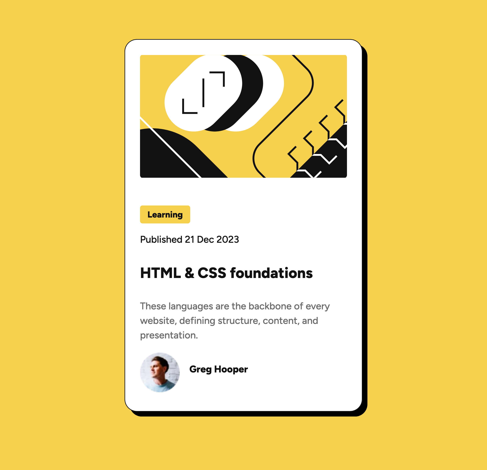

# Frontend Mentor - Blog preview card solution

This is a solution to the [Blog preview card challenge on Frontend Mentor](https://www.frontendmentor.io/challenges/blog-preview-card-ckPaj01IcS). Frontend Mentor challenges help you improve your coding skills by building realistic projects. 

## Table of contents

- [Overview](#overview)
  - [The challenge](#the-challenge)
  - [Screenshot](#screenshot)
  - [Links](#links)
- [My process](#my-process)
  - [Built with](#built-with)
  - [What I learned](#what-i-learned)
  - [Continued development](#continued-development)
  - [Useful resources](#useful-resources)
- [Author](#author)
- [Acknowledgments](#acknowledgments)


## Overview

### The challenge

Users should be able to:

- See hover and focus states for all interactive elements on the page

### Screenshot



### Links

- Solution URL: [Solution URL](https://github.com/cfofana/blog-preview-card)
- Live Site URL: [Live Site](https://cfofana.github.io/blog-preview-card/)

## My process

### Built with

- Semantic HTML5 markup
- CSS custom properties
- Flexbox
- Mobile-first workflow

### What I learned

- Structing html for easier styling
- Mobile first for easier responsive styling
- Changing all the fonts in a page by changing the font size of the body at a certain screen size

```css
@media screen and (min-width:1440px) {
    body {
        font-size: 16px;
    }
    .container {
        width: 384px;
    }
}
```

### Continued development

Spacing, growing proficient at Figma


### Useful resources

- [CSS Box Shadow](https://www.w3schools.com/cssref/css3_pr_box-shadow.php) - This helped me apply box shadows correctly. It has a simple explanation.

## Author

- Website - [Ceesay Fofana](https://www.ceesayfofana.com)
- Frontend Mentor - [@yourusername](https://www.frontendmentor.io/profile/cfofana)
- GitHub - [Ceesay Fofana](https://github.com/cfofana)
- LinkedIn - [Ceesay Fofana](https://www.linkedin.com/in/ceesay/)
